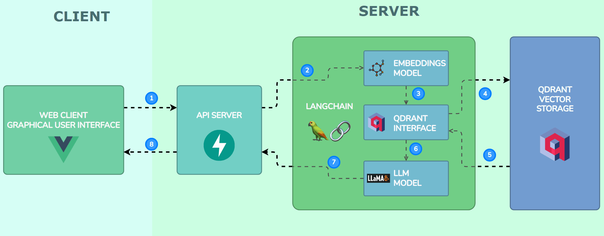

# Chatbot Portfolio Backend
This is the backend of the portfolio project **Chatbot Portfolio**. It uses FastAPI, Langchain and Qdrant for RAG implementation.

<p align="center">
  
</p>

This backend offers a single endpoint for chatbot implementation using Langchain, LlamaCPP, Qdrant and Sentence-Trasformers.

Read the article attached [here](https://medium.com/@piero.casusolv/implementing-rag-with-vue3-fastapi-and-qdrant-and-how-is-this-compared-to-openai-gpts-afa5d5e8d08f).

## Implementation Disclaimer
After the release of Open AI GPT's, this server was shutdown in order to make a full client web application redirecting to GPT's. This is in order to save resources. However, this application can be cloned, tested and modified if needed. For frontend implementation see [this repo](https://github.com/IA-PieroCV/chatresume-frontend). For client implementation [click here](https://chatapp.intautomation.net). For GPT's implementation [click here](https://chat.openai.com/g/g-oK5Dh6p5x-pierocv-chat-resume).

## Instalation
This section shows the process to install the full chatbot from scratch.

### Core Installation
Python is the base language of this server application, so an environment (using conda environment or virtualenv) is highly recommended. This application was tested on Python 3.11.5.

1. Install the requirements using: 
```bash
pip install -r requirements.txt
 ```
2. Download and locate the model on the models folder on `app/core/models`. You can download the model from [Hugging Faces here](https://huggingface.co/TheBloke/SynthIA-7B-v2.0-GGUF/blob/main/synthia-7b-v2.0.Q2_K.gguf).

*Note: You can use any model you want, but ensure that the prompt is correctly formatted on `app/core/setup_bot.py`.*

3. Put the CV information in the `app/core/database_files` in TXT format (with `CVText.txt` name for straighforward execution). You can change the file input on `app/core/setup_bot.py`.

4. You can test the solution directly using
```bash
uvicorn app.main:app
```

### Qdrant Implementation
A Qdrant docker compose file is provided on `images/docker-compose.yml` to use Vector Store in this solution (the most recommended way to make RAG).

5. Deploy the docker container for Qdrant Vector Database.
```bash
docker compose -f ./images/docker-compose.yml up -d
```

### Docker Setup for Deployment
**WARNING**: I highly recommend that you can test the LLM locally before implementing this to a docker container for production. Due to requirements and large files, the build could take long time. Be careful in your CI/CD processes.
I provide a `.dockerignore` file in order you to take out the files you consider not needed.

6. In order to run this project you can also build your own docker image and run it on a server. A DockerFile is provided for this.
```bash
docker build -t chatbot-backend
``` 

7. Once the image is built, you can run it using the `docker run` command.
```bash
docker run chatbot-backend -p 8000:8000
```

## Practical Solutions
- Due to the lack of efficiency of embeddings models, the full document could be provided to the LLM manually. This can be implemented on the `app/core/setup_bot.py`. Qdrant and embedding models wouldn't be used with this approach.
- As the initial version of the software (non-comitted) was used without LangServe to custom output format, LangServe was not used for this implementation.

## Potential Improvements
- A CI/CD pipeline is always valuable. A Github action for build and host the docker image could be potentially implemented.

## Issues or Contributions
Feel free to open an issue or pull request. As is a small portfolio project, you can use the format you consider most useful. Thank you in advance!

## License
The current repository has MIT License. Please check it on the `LICENSE` file.
